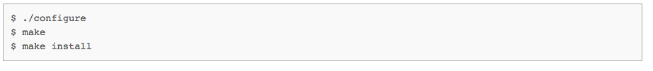

##CS 198 Project Demo
Java API Implementation of Attribute-based Encryption for Dropbox

Authors
Isabelle Tingzon - ibtingzon2@gmail.com
Angelu Kaye Tiu - angelukayetiu@gmail.com

##Dependencies
Download and install:

[PBC Library](http://crypto.stanford.edu/pbc/)

[Java Dropbox SDK](https://www.dropbox.com/developers/core/sdks/java)

**If CPABE fails, then run the following in the command line for the following folders /CryptoCloud/libbswabe-0.9 and /CryptoCloud/cpabe-0.11:

</img>

## Instructions
To install, clone this repository and open CryptoCloud as a project in Netbeans 8.0.2.

Build and run CryptoCloud.
Click File >> Open and select the file you wish to encrypt and upload.
