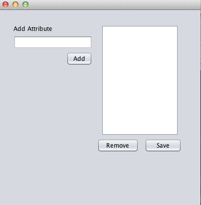

##CS 198 Project Demo
Java API Implementation of Attribute-based Encryption for Dropbox

Authors
Isabelle Tingzon - ibtingzon2@gmail.com
Angelu Kaye Tiu - angelukayetiu@gmail.com

##Dependencies
Download and install:

[PBC Library](http://crypto.stanford.edu/pbc/)

[Java Dropbox SDK](https://www.dropbox.com/developers/core/sdks/java)

Note: If CPABE fails, then run the following in the command line for the following folders /CryptoCloud/libbswabe-0.9 and /CryptoCloud/cpabe-0.11:

</img>

## Instructions
**Installation**

To install, clone this repository and open CryptoCloud as a project in Netbeans 8.0.2.

Build and run CryptoCloud.

**Authorization**
1. Go to the specified URL.
2. Click "Allow" (you might have to log in first)
3. Copy and paste the authorization code into the API.

**Managing Attributes**
1. Click Manage Attributes.

</img>
2. You may add attributes by specifying each attribute in the textfield.
3. To remove attributes, select attribute from list and press Remove.
4. **To generate your private key, select the attributes you wish to save and press Save.**

**Encryption and Upload**
1. Click File >> Open and select the file you wish to encrypt and upload.
2. Click Encrypt button and specify the policy (e.g. professor and dean)
3. Click Upload.

Note: You may need to click the Refresh Button to view the recently uploaded files.

**Decryption Download**

Select the file on the left pane that you wish to download, and press Download.

Note: To decrypt successfully, the encrypted file and private key must be in the same folder. 
